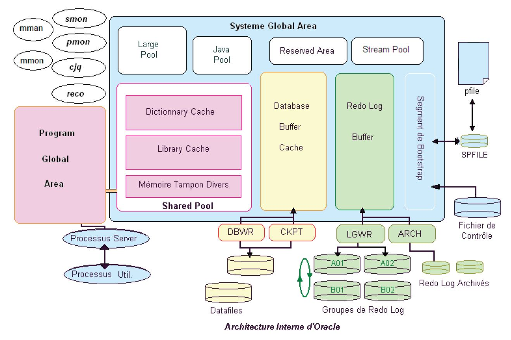

Team
Animateur : Costes
Secrétaire : Gily
Scribe : Fantou
Gestionnaire : Nico

## Mots Clés
-	Tablespace : Un **tablespace** est un espace de stockage dans lequel des données composant les bases de données peuvent être enregistrées. Il fournit une couche d'abstraction entre les données logiques et les données physiques, et sert d'espace d'allocation pour tous les segments pris en charge par le sgbd
-	SQL + : outil oracle en ligne de commande 
-	PMON : Process Monitor (PMON) : chargé du nettoyage lors du plantage d’un processus utilisateur. Il libère les ressources de sessions qui se sont mal terminées.
-	Control Files : fichiers avec la config
-	Base de données :-
-	Fichiers de journalisation : logs
-	DBA : db admin
-	~Fichiers de configuration~
-	~Instance~
-	~Dictionnaire de données~

## Contexte
Quoi ?
	Installer une base de données
Comment ?
	Utiliser SQL + (PL/SQL)
Pourquoi ?
	Respecter demande du client

## Contraintes

-	2 jours
-	Données confidentielles  Tablespace séparé
-	Fichiers de journalisation archivés
-	Processus PMON démarré automatiquement
-	Chaque BDD ne doit avoir qu'une seule instance
-	Conserver une copie du fichier de config
-	Pouvoir sélectionner l'emplacement des Control Files
-	Accès visuel à la BDD, pas de SQL + pour le client

## Problématique

~Comment mettre en place une BDD avec SQL + ?~
Comment mettre en place un environnement de BDD ? (Oracle 11gr2)

## Généralisation
Gestion de données

## Hypothèses
- 	Une API est une interface de programmation
-	Processus PMON = Journalisation automatique
-	Fichier de journalisation = Fichier de log
-	DBA = Database Administrator
-	SQL + = Ligne de commande en SQL
-	Tablespace est une partie encryptée
-	Tablespace peut être extensible ou non

## Plan d'action

## Etude :
### Oracle GR2
####  Logique

1 instance de bdd appellée database
une instance est constituée :
- une zone de mémoire partagée appelée System Global Area (SGA)
- un ensemble de processus d'arrière plan ayant chacun un rôle bien précis
- un ensemble de processus serveur chargés de traiter les requêtes utilisateurs

la bdd est l'ensemble des fichers qui premettent de gérer les donées, elle est donc constituée de :
- un fichier de contrôle, contenant les infos sur tous les autres fichiers (nom, taille, path)
- des fichiers de Redo Log, contenant l'activité des sessions connectées à la base. C'est des logs des transactions de la base. Ils sont organisés en groupes possédants le même nombre de membres. Et plus tard des Redo Logs archivés contenant les anciens logs
- un ou plusieurs fichiers de donées qui contiennent les données des tables de la base. après création de la base il y a au moins:
	- un tablespace SYTEM contenant le dico de données
	- un tablespace SYSAUX auxiliaire du tablespace SYSTEM contenant des fonctions Oracle ou des données utilisées par des outils tels que le référentiel d'OEM
	- un tablespace temporaire TEMP récupérant les segments emporaires utilisés par les requpetes
	- UNDO récupérant la version précédente des données en cours de modif par les transactions
	- USERS tablespace de travail par défaut des utilisateurs
- un fichier de paramètres binaire SPFIL\<SID>.ORA  contenant les paramètres de démarrage de l'instance et d'autres valeurs qui déterminent l'environement dans  lequel elle s'exécute, il est créé à partir du fichier INIT\<SID>.ORA
- Un fichier de mots de passe avec le mdp du SYSDBA (et d'autres ou pas?)

Une instance est l'ensemble des processus d'arrière plan (background processes) et zones mémoires qui sont allouées au démarrage de la base de données, pour permettre l'exploitation des données.
Une instance ne peut ouvrir qu'unebdd à la fois et la plupart du temps une bdd n'est ouverte que par une seule instance

Si on met en oeuvre l'option RAC (Oracle Real Application Clusters)  qui permet d'utiliser Oracle sur des serv en cluster on peut avoir une bdd ouverte par plusieurs instanes sur des noeuds distincrs du cluster. Elle permet une plus haute disponibilité mais est plus complexe à mettre en oeuvre

il y a en plus des processus de l'instance des processus utilisateurs correspondants à l'appli de l'utilisateur pour se co à la base. Dans une archi client/serv ces processus sont situés sur le poste de l'utilisateur et communiquet avec le serv à travers le réseau grâce à la couche Oracle Net

**Connexion**
quand un utilisateur se co il ouvre une session. Les processus utilisateurs sont pris en charge par les processus serv  chargés de traiter les requêtes users (par exemple charger les données nécssaires dans le Database Buffer Cache

Le processus serv communique avec un processus utilisateur correspondant à l'appli

Dans la confi par défaut Oracle lance un processus serv dédié à chaque utilisateur (dedicated server configuration).
On peut config Oracle en multithread server (MTS) pour avoir des processus serveur partagés par plusieurs processus utilisateurs.

L'instance est dimensionnée par des paramètres stockés dans le fichier SPFILE< SID>.ora créé à la créa de la bdd à partir d'un fichier de paramètre caractère: PFILE< SID>.ora

**PGA (program Global Area)**

Mémoire privée des différents processus distribuée à la co du client
Pour un processus la GPA contient:
-une zone de tri (allouée dynamiquement lors d'un tri)
- des infos sur la session
- des infos sur le traitement des requêtes de la session
- les variables de session
En multithread une partie de la PGA est stockées dans la SGA (dans la *Large Pool* ou le *Shared Pool* ). A partir de 9i, la PGA est dynamique et est config dans PGA_AGGREGATE_TARGET

**SGA(System Global Area)**

zone mémoire partagée par les différents processus de l'instance, elle est alloué au début de l'instance et libérée à son arrêt

La SGA est composée de:
- SPA (Shared Pool Area): zone de partage des requêtes (Library Cache) et du dico(Dictionary cache) entre les processus
- Database Buffer Cache: cache qui joue le même rôle que le SPA mais pour les données de la base, elles ne sont accessible en lecture et maj qu'après avoir été chargées dans le DBC. dans la pratique vu que le DBC a une taille finie Oracle utilise l'algo Least Recently Used  pour suppr les données les moins récentes en cas de manque de place. La taille du bloc (DB_BLOCK_SIZE) est fixée à la création de la base. LA taille de DBC est éfinie par DB_BLOCK_BUFFERS (valeur généralement entre 1ko et 100ko pour le nombre de buffers et DB_BLOCK_SIZE pour la taille de chaque bloc. Il est dimensioné par DB_CACHE_SIZE (mais on a dit autre chose juste avant o.O)
- Redo Log Buffer : stock les infos sur les modifs apportées à la base avant leur écriture dans le redo log. Son écrture est séquentielle  et circulaire. Il est dimensionée par LOG_BUFFER
- Large Pool (depuis v8) ajouté à l'exterieur du shared pool pour  donner de l'espace spécifique aux oper parallèles pour MTS et le modue RMAN. Dimensionnée par LARGE_POOL_SIZE
- Java Pool, zone réservée aux prog Java, dimensionné par le paramètre JAVA_POOL_SIZE
- Streams Pool (v10+) réservée otamment lors de la répli entre bases distantes. Dimensionnée par STREAM_POOL_SIZE
- Reserved Area (v7.3+) réservée déstinée à l'enregistrement d'objets SQL de grande taille (packages, procédures et fonctions)
- result_cache: depuis la 11g : dans le SGA utilisé pour initialiser le param MEMORY_TARGET, par défaut à 128k
Toutes ces zones sont config dans le fichier SPFILE. En dehors de la SGA chauque processus possède une zone privée appellée PGA (Program Global Area)

vue dynamique V$MEMORY TARGET ADVICE
permet de suivre l'alloc dynamique et vusaliser les différentes valeurs de l'alloc dynamique de la mémoire.

Elle contient les colonnes:
- Memory size: taille réelle de la mémire allouée à l'instance
- Size_factor: coef de taille
- Estd_db_time: taille d'instance utilisée en mémoire en moyenne par rapport aux facteur size-factor et time_factor
- Time_factor: coef de temps
- Version
vue V$MEMORY_DYNAMIC_COMPONENTS, permet de visualiser les différentes valeurs de chaque pool (shared_pool, database buffer cache, large pool, etc)

Fichier de param init.ora ou SPFILE.ora
Au démarrage l'instance lit un fichier de param qui contient tous les param d'initialisation. Il est géré par le DBA

Ces param permettent:
- d'allouer la mémoires souhaitée aux différentes structures de la SGA
- trouver le nom et l'emplacement des fichiers de contrôles de la base

Il y a 2 types de param: dynamiques et statiques
Les param dynamiques sont modifiables sans avoir besoin d'arrêter la bdd
Les vues V$SYSTEM_PARAMETER et V\$SYSTEM_PARAMETER2 (comme l'autres mais les param sont mis en forme) permettent de connaitre les valeurs des prams de l'instance en cours

Règles: 
- les params sont spécifiés sous la forme nom_param = valeur
- tous les params sont optionnels et ont une valeur par défaut
- des commentaires peuvent être ajoutés avec #
- la valeur peut petre spécifiée entre guilements doubles s'il y des caractères spéciaux ("=", " ", etc)
- les valeurs multiples sont spécifiées entre parenthèses, séparées par des virgules

**Processus d'arrière plan**
Important de la distinguer des autres processus. Ils sont indépendants de la connexion des users et sont lancés au démarage de l'instance et arrêtés avec elle.
Ils réalisent des oper sur l'instance et la bdd comme l'écritue des fichiers de données, la récup de la bdd ou la résolution des erreurs.
Certains processus aident à augmenter les perfs globales du sytème.

### Principaux processus:
- Database Writer (DBWRn) : écrit sur disque les données modifiées dans le Database Buffer Cache. Les informations de la base de données manipulées par les sessions transitent par ce cache dédié à cet
usage.
- Log Writer (LGWR) : écrit sur disque le contenu du Redo Log Buffer dans les fichiers Redo.
- Checkpoint (CKPT) : enregistre les checkpoints dans l’en-tête des fichiers de données. Lorsque qu’un checkpoint a lieu, toutes les informations qui se trouvent en mémoire sont enregistrées sur disque à
l’emplacement prévu. Cet évènement correspond à un « jalon » permettant la restauration des données
jusqu’à ce point précis dans le temps. CKPT peut à son tour déclencher DBWR et LGWR.
- Process Monitor (PMON) : chargé du nettoyage lors du plantage d’un processus utilisateur. Il libère les ressources de sessions qui se sont mal terminées.
- System Monitor (SMON) : restauration de l’instance après un arrêt anormal. C’est le gardien de la cohésion des données. Une instance cohérente est établie chaque fois que la base est démarrée.
- Job Queue Coordinator (CJQ) : utilisé par le Scheduler, il génère les processus pour exécuter les jobs planifiés qui se trouvent dans la file d’attente interne d’Oracle.
- Les utilisateurs peuvent créer des jobs et les soumettre à ce coordinateur.
JOB_QUEUE_PROCESSES > 0 permet de définir le nombre de jobs soumis en simultané.
- Memory Manager (MMAN) : il agit comme un distributeur de mémoire et coordonne la taille allouée aux
différents composants.
- Memory Monitor (MMON) : programme et déclenche ADDM (L’Automatic Database Diagnostic Monitor) qui effectue des analyses pour déterminer des problèmes potentiels.

Selon la config du serv d'autres processus d'arrière plan peuvent être présents:
- Archiver (ARCn) en base "archivée" il archive des fichiers de Redo Log chaque fois qu'un ficher Redo est plein
- Recover (RECO): gérer les bases de données distribuées
- Dispatcher (Dnnnn) présent sur serv partagé
- Global Cache service (LMS) préset en option RAC
-  Job Queue (SNPn) processus chargé de rafraîchir les snapshots ou d'exécuter périodiquement des tâches programmées avec le package DBMS_JOB

### Les fichiers de données 
Ils contiennent les données de la base (tables, index, valeurs?) et sont logiquement regroupés en tablespaces

Un tablespace est une unité logique de stockage composée d'un ou plusieurs fichiers physiques.
La quasi totalité des opérations d'administration relatives au stockage s'effectue en travaillant sur le tablespace et non sur le fichier de données.
En pratique, une bas comportera donc d'autres fichiers de données appartenant à d'autres tablespaces

Les fichiers de données sont découpés en blocs d'une taille définie à la création de la base (2, 4, 8ko etc) La taille du bloc oracle est définie par le paramètre DB_BLOC_SIZE
L'espace occupé par un objet dans un tablespace est appellé "segment". Un ensemble de blocs contigus dans un fichier de données est appellé un "extent"

ici on a la table Pays qui est un objet logique stocké dans le tablespace DATA et est constitué de 3 extents: 2 dans DATA01.DBF et 1 dans le 02

il y a 4 types de segments gérés dans une base oracle:
- les segments de table : espace occupé par ls tables
- les segments d'index : espace occupé par les index
- les segments d'annulation: espace temporaire utilisé pour stocker les info servant à rollback
- les segments temporaire: utilisés lors d'un tri dans une requête

La règle est d'utiliser plusieurs tablespaces pour séparer les différents objets de la base et d'assurer de meilleures performances à la base de données. Cela permettra également d'offrir une plus grande souplesse dans les tâches d'administration. Chaque type de segment est stocké dans un tablespace propre pour des raisons de perf. 
Lorsqu'un segment est créé dans un tablespace oracle lui alloue un premier extent, quand celui-ci est plein un deuxième et etc. Lorsqu'un segment 

Tablespace SYSTEM: contient le dico de donées, à la créa de la bdd le dico est installé dans le tablespace par l'utilisateur SYS. Depuis la 10g il n'y a rien de plus et le reste est dans SYSAUX pour des raisons de perf

SYSAUX contient ? schéma pas clair
il est défini avec les attributs:
- permanent
- read write
- extent managment local
- segment space managment auto

on peut créer nos tables dans les tablespaces SYSTEM et SYSAUX mais c'est déconseillé 
avantages de sysaux:
- utilisé par défaut pour certaines fonctionnalités
- moins de charge pour SYSTEM
- 

#### Physique

###	Tablespace
###	SQL +
###	PMON

process monitor, une des processus d'oracle. Il est chargé du nettoyage lorsqu'un processus utilisateur plante. Il libère les ressources des sessions qui se sont mal terminées

###	Control Files
###	Journalisation
###	Installation BDD

###	Les bases des BDD
	Dictionnaire de données
	Vues
	Requêtes

### Réalisation
o	Installation BDD
o	Workshop
